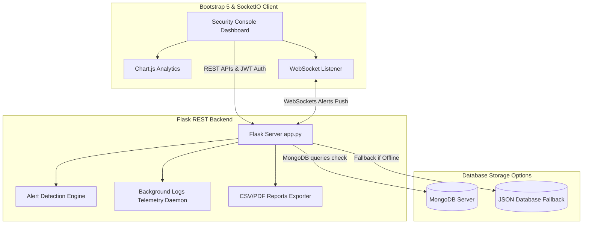

# CyberGuard SIEM Lite - Security Event Monitoring Dashboard

CyberGuard SIEM Lite is a lightweight Security Information and Event Management (SIEM) console designed for security analysts and admins. It correlates system logs, alerts on threats, manages incidents, compiles compliance reports, and integrates a hacking simulator to visualize attacks.

---

## 📐 SIEM Architecture Diagram

---

## 📂 MongoDB Collections Schema

### `users`
* `_id`: String (UUID)
* `username`: String (Unique)
* `email`: String (Unique)
* `password_hash`: String (bcrypt hashed)
* `role`: String (`Admin` or `Security Analyst`)
* `created_at`: Date

### `logs`
* `_id`: String (UUID)
* `timestamp`: Date
* `source`: String (Host system service)
* `event_type`: String (Security action type)
* `severity`: String (Informational, Low, Medium, High, Critical)
* `ip_address`: String (Source IP address)
* `username`: String (Associated account username)
* `message`: String (Log detail message)
* `status`: String (`success` or `failure`)
* `country` / `city`: GeoIP Location values

### `alerts`
* `_id`: String (UUID)
* `alert_type`: String (Attack threat type)
* `severity`: String (High, Critical)
* `source_ip`: String (Hostile IP)
* `description`: String (Event description details)
* `status`: String (`Open`, `Investigating`, `Resolved`, `Closed`)
* `created_at`: Date

### `incidents`
* `_id`: String (UUID)
* `title`: String (Case name)
* `description`: String (Action steps)
* `severity`: String
* `assigned_to`: String
* `status`: String (`Open`, `Investigating`, `Resolved`, `Closed`)
* `created_at` / `updated_at`: Dates

### `audit_logs`
* `_id`: String (UUID)
* `user`: String (Operator username)
* `action`: String (Change category)
* `timestamp`: Date
* `ip_address`: String (Operator IP)
* `details`: String (Transaction details)

---

## ⚡ API Endpoints Summary

| Method | Endpoint | Access Role | Description |
| :--- | :--- | :--- | :--- |
| **POST** | `/api/auth/register` | Public | Register new Security Analyst or Admin |
| **POST** | `/api/auth/login` | Public | Login credentials, return JWT access token |
| **POST** | `/api/auth/logout` | JWT | Terminate session, log audit event |
| **POST** | `/api/logs` | Public | Ingest security log, check alert correlation |
| **GET** | `/api/logs` | JWT | Fetch paginated security logs list |
| **GET** | `/api/logs/search` | JWT | Multi-parameter search & date filtering |
| **PUT** | `/api/logs/<id>` | Analyst | Update log details |
| **DELETE** | `/api/logs/<id>` | Admin | Delete log entry |
| **GET** | `/api/alerts` | JWT | Fetch correlation alerts raised |
| **PUT** | `/api/alerts/<id>` | Analyst | Update alert status/assignee (Triage) |
| **DELETE** | `/api/alerts/<id>` | Admin | Wipes alert alarm |
| **POST** | `/api/incidents` | Analyst | Log new incident case manually |
| **GET** | `/api/incidents` | JWT | Fetch incident workflows |
| **PUT** | `/api/incidents/<id>` | Analyst | Update incident status/remediation details |
| **DELETE** | `/api/incidents/<id>` | Admin | Wipes incident case |
| **GET** | `/api/audit` | JWT | Fetch immutable audit trail log logs |
| **GET** | `/api/reports/stats` | JWT | Fetch dashboard statistics counts |
| **GET** | `/api/reports/export/csv/<type>` | JWT | Export logs/alerts/incidents to CSV file |
| **GET** | `/api/reports/export/pdf` | JWT | Export executive compliance posture to PDF |
| **POST** | `/api/simulator/brute-force` | Analyst | Simulate brute-force logs triggers |
| **POST** | `/api/simulator/port-scan` | Analyst | Simulate port sweep logs triggers |
| **POST** | `/api/simulator/suspicious-login` | Analyst | Simulate suspicious login logs triggers |

---

## 🚀 Installation & Launch Steps

For setup instructions using a local virtual environment or Docker, please read [Installation_Guide.md](file:///c:/Users/tharu/OneDrive/Desktop/CyberGuard-SIEM-Lite/docs/Installation_Guide.md).

---

## 🧪 Postman API Testing Guide

A pre-configured Postman Collection is located at [postman/CyberGuard-SIEM.postman_collection.json](file:///c:/Users/tharu/OneDrive/Desktop/CyberGuard-SIEM-Lite/postman/CyberGuard-SIEM.postman_collection.json).

### How to use the collection:
1. Open **Postman**.
2. Click **Import** in the top left, and upload the `CyberGuard-SIEM.postman_collection.json` file.
3. Select the collection **"CyberGuard SIEM Lite REST API"**.
4. Configure the environment variable:
   * Key: `base_url` -> Value: `http://localhost:5000/api`
5. **Authenticating API Calls**:
   - Run the request `1. Auth / Login User`.
   - The collection includes a **Postman test script** that parses the response JSON, extracts the JWT access token, and automatically binds it to a collection-level environment variable named `jwt_token`.
   - All subsequent requests (logs search, alert status, manual incidents, audit tables) will automatically send this Bearer token in the request header!
